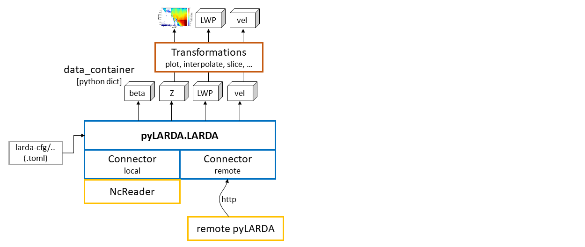

## pyLARDA v3
pyLARDA for accessing and analysing ground based remote sensing data. 
It tries to simplify following tasks:

- finding netcdf files in a complex folder structure
- loading data from differently formatted netcdfs
- stitching data from consecutive files together
- simplify common plotting tasks

Documentation is available at [larda-doc](https://lacros-tropos.github.io/larda-doc/)

### Requirements
Currently pyLARDA is only targeted on unix operating system. 

```
numpy
netCDF4
scipy
matplotlib
toml
msgpack
tqdm

numba
cython
# and for the documenttation
sphinx
recommonmark
sphinx_rtd_theme
```

### Setup
Firstly, clone the repository and make sure all dependencies are installed.
Depending on your datasource of choice:

#### remote
You just need to know the link to the backend backend of choice and may move to Quickstart.

#### local
For local data it is necessary to include the source in a certain directory structure. For the setup of the config files consult the Guide to config-files.

```
├── larda        # github managed source code
│   ├── docs
│   ├── examples
│   ├── ListCollector.py
│   ├── pyLARDA  # actual python module
│   ├── README.md
│   ├── requirements.txt
│   └── run_docs.sh
├── larda-cfg  # configuration files
│   ├── campaigns.toml
│   ├── [single campaign].toml
│   └── [single campaign].toml
├── larda-connectordump
│   └── [auto generated subfolder for each campaign]
├── larda-description
│   ├── [...].rst
└── larda-doc           # folder if you want to generate the docs
    └── ... 
```

### Quickstart
Make sure that the module is available at your pythonpath when in doubt use `sys.path.append('dir')`.

```python
import pyLARDA

link_to_backend = 'http://...' 
# or use pyLARDA.LARDA('local')
larda = pyLARDA.LARDA('remote', uri=link_to_backend)
print('available campaigns', larda.campaign_list)
larda.connect('campaign_name')
larda.print_params()
MIRA_Zg = larda.read("MIRA","Zg", [dt_begin, dt_end], [0, 4000])
fig, ax = pyLARDA.Transformations.plot_timeheight(MIRA_Zg, range_interval=[500, 3000],
                                                  z_converter='lin2z')
fig.savefig('MIRA_Z.png', dpi=250)
```

For more examples refer to the scripts in the `examples` directory.


### Architecture




### Documentation
An online version of the documentation is available at <https://lacros-tropos.github.io/larda-doc/>.
For building simply run `.\run_docs.sh`, when the additinal libraries (`sphinx`, `recommonmark` and `sphinx_rtd_theme` are available; see above).

### History
This version of the LACROS research data analyser (LARDA) is based on two prior versions in C and python2 respectively.
Major changes are the migration to python3, netcdf4 and the inclusion of radar Doppler spectra.


### License
Copyright 2019, Johannes Bühl, Martin Radenz, Willi Schimmel, Teresa Vogl
[MIT License](http://www.opensource.org/licenses/mit-license.php)

