######################
How to use larda
######################

Initialize
----------

.. code-block:: python

    #!/usr/bin/python3
    import sys
    sys.path.append('<path to local larda directory>')
    import pyLARDA
    import pyLARDA.helpers as h

    # optionally configure the logging
    # StreamHandler will print to console
    import logging
    log = logging.getLogger('pyLARDA')
    log.setLevel(logging.DEBUG)
    log.addHandler(logging.StreamHandler())

    # init larda
    # either using local data
    larda=pyLARDA.LARDA()
    # or loading data via http from backend
    larda = pyLARDA.LARDA('remote', uri='<url to larda remote backend>')
    print("available campaigns ", larda.campaign_list)

    # select a campaign
    larda.connect('lacros_dacapo')

Load data
---------

Get the data container for a certain system and parameter.

.. code-block:: python

    improt datetime
    # Initialize larda as described above

    begin_dt = datetime.datetime(2018, 12, 18, 6, 0)
    end_dt = datetime.datetime(2018, 12, 18, 11, 0)

    MIRA_Zg = larda.read("MIRA", "Zg", [begin_dt, end_dt], [0, 'max'])
    #
    shaun_vel=larda.read("SHAUN", "VEL", [begin_dt, end_dt], [0, 'max'])

Simple plot
-----------

.. code-block:: python
        
    begin_dt = datetime.datetime(2018, 12, 18, 6, 0)
    end_dt = datetime.datetime(2018, 12, 18, 11, 0)
    CLOUDNET_Z = larda.read("CLOUDNET", "Z", [begin_dt, end_dt], [0, 'max'])
    fig, ax = pyLARDA.Transformations.plot_timeheight(
        CLOUDNET_Z, range_interval=[300, 12000], z_converter='lin2z')
    fig.savefig('cloudnet_Z.png')

    CLOUDNET_class = larda.read("CLOUDNET", "CLASS", [begin_dt, end_dt], [0, 'max'])
    fig, ax = pyLARDA.Transformations.plot_timeheight(
        CLOUDNET_class, range_interval=[300, 12000])
    fig.savefig('cloudnet_class.png')

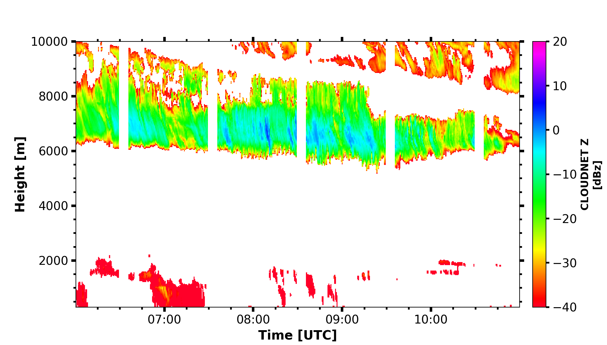

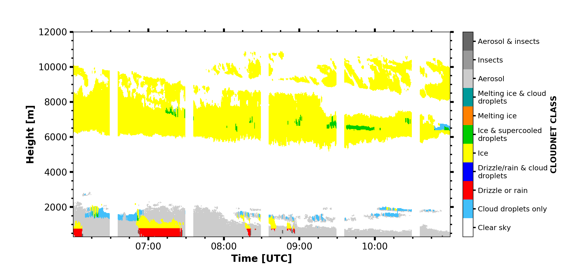

Modify plot appareance
----------------------

.. code-block:: python

    begin_dt=datetime.datetime(2019,2,4,0,1)
    end_dt=datetime.datetime(2019,2,5,20)
    plot_range = [50, 6500]

    attbsc1064 = larda.read("POLLY","attbsc1064",[begin_dt,end_dt],[0,8000])
    attbsc1064['colormap'] = 'jet'
    fig, ax = pyLARDA.Transformations.plot_timeheight(
            attbsc1064, range_interval=plot_range, fig_size=[20,5.7], z_converter="log")
    ax.xaxis.set_major_formatter(matplotlib.dates.DateFormatter('%d.%m. %H:%M'))
    ax.xaxis.set_major_locator(matplotlib.dates.HourLocator(byhour=[0, 6, 12, 18]))
    ax.xaxis.set_minor_locator(matplotlib.dates.MinuteLocator(byminute=[0,]))
    fig.savefig('polly_bsc1064.png')

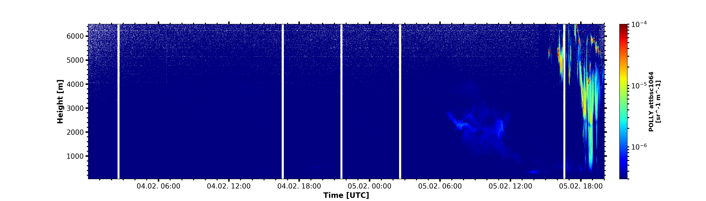

Timeseries plot
---------------

.. code-block:: python

    begin_dt = datetime.datetime(2019, 4, 8, 18, 0)
    end_dt = datetime.datetime(2019, 4, 9, 8, 0)
    parsivel_rainrate = larda.read("PARSIVEL", "rainrate", [begin_dt, end_dt])

    #convert rainrate in m s-1 to mm h-1
    # modify dict by hand 
    #parsivel_rainrate['var'] = parsivel_rainrate['var']*3600/1e-3
    #parsivel_rainrate["var_unit"] = 'mm/h'
    #parsivel_rainrate['var_lims'] = [0,10]

    # or use the Transformations.combine syntax
    def to_mm_h(datalist):
        return datalist[0]['var']*3600/1e-3, datalist[0]['mask']
    parsivel_rainrate = pyLARDA.Transformations.combine(
        to_mm_h, [parsivel_rainrate], {'var_unit': 'mm/h', 'var_lims': [0,5]})
    fig, ax = pyLARDA.Transformations.plot_timeseries(parsivel_rainrate)
    fig.savefig('parsivel_rain_rate.png')

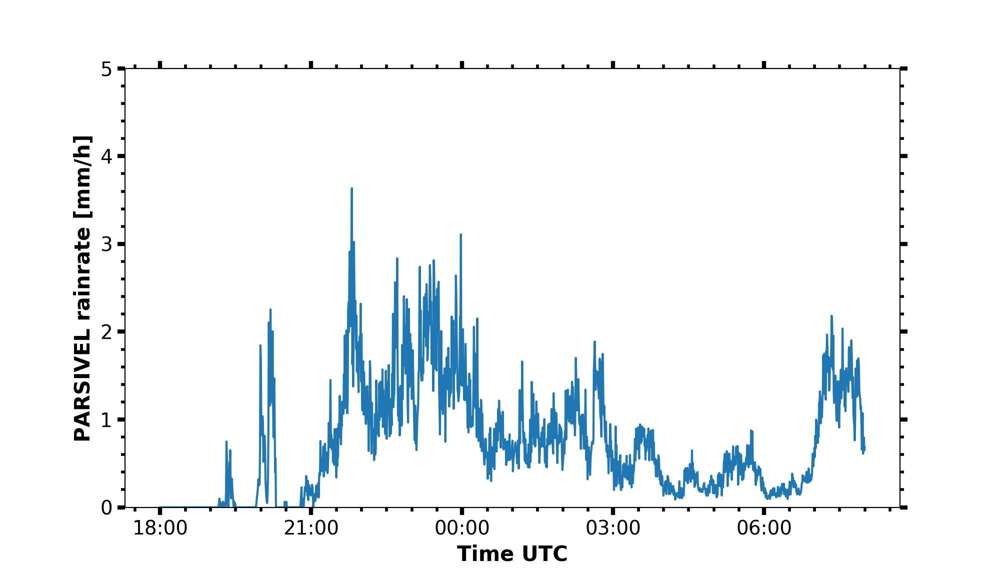

Scatter plot
------------

.. code-block:: python

    begin_dt = datetime.datetime(2018, 12, 6, 0, 0, 0)
    end_dt   = datetime.datetime(2018, 12, 6, 0, 30, 0)

    # load the reflectivity data
    MIRA_Z = larda.read("CLOUDNET", "Z", [begin_dt, end_dt], [0, 'max'])
    LIMRAD94_Z = larda.read("CLOUDNET_LIMRAD", "Z", [begin_dt, end_dt], [0, 'max'])

    LIMRAD94_Z_interp = pyLARDA.Transformations.interpolate2d(LIMRAD94_Z, 
                                            new_time=MIRA_Z['ts'], new_range=MIRA_Z['rg'])
    fig, ax = pyLARDA.Transformations.plot_scatter(MIRA_Z, LIMRAD94_Z_interp, var_lim=[-75, 20],
                                            x_lim = [-50, 10], y_lim = [-50, 10],
                                            custom_offset_lines=5.0, z_converter='lin2z')
    fig.savefig('scatter_mira_limrad_Z.png', dpi=250)

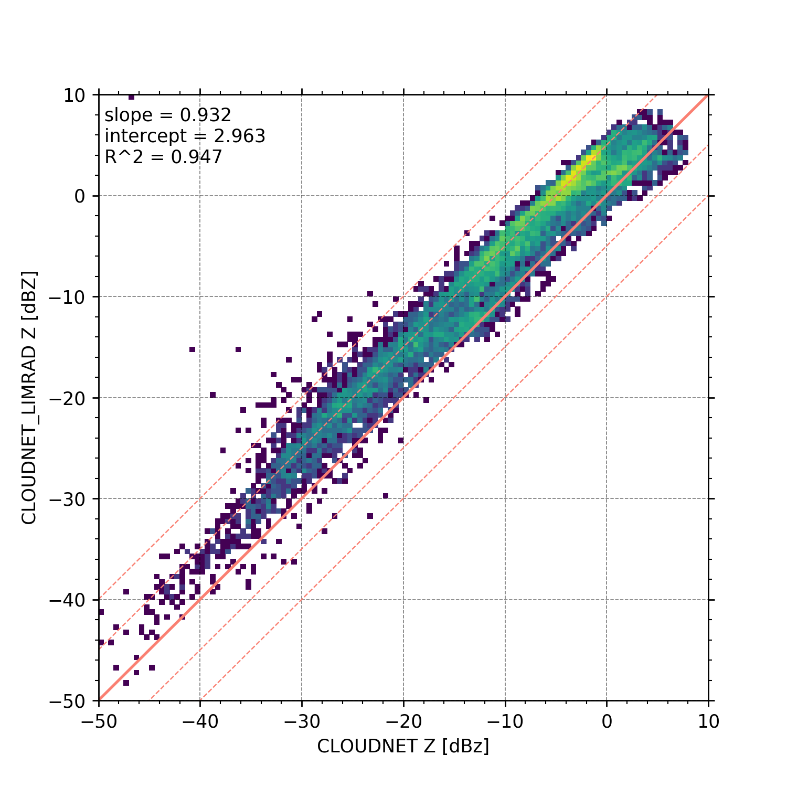

Frequency of occurence
----------------------

.. code-block:: python

    begin_dt = datetime.datetime(2019, 2, 6)
    end_dt = datetime.datetime(2019, 2, 6, 23, 59, 59)
    plot_range = [0, 12000]

    LIMRAD94_Ze = larda.read("LIMRAD94", "Ze", [begin_dt, end_dt], plot_range)
    # load range_offsets, dashed lines where chirp shifts
    range_C1 = larda.read("LIMRAD94", "C1Range", [begin_dt, end_dt], plot_range)['var'].max()
    range_C2 = larda.read("LIMRAD94", "C2Range", [begin_dt, end_dt], plot_range)['var'].max()
    # load sensitivity limits (time, height) and calculate the mean over time
    LIMRAD94_SLv = larda.read("LIMRAD94", "SLv", [begin_dt, end_dt], plot_range)
    sens_lim = np.mean(LIMRAD94_SLv['var'], axis=0)

    fig, ax = pyLARDA.Transformations.plot_frequency_of_occurrence(
        LIMRAD94_Ze, x_lim=[-70, 10], y_lim=plot_range,
        sensitivity_limit=sens_lim, z_converter='lin2z',
        range_offset=[range_C1, range_C2], 
        title='LIMRAD94 Ze -- date: {}'.format(begin_dt.strftime("%Y-%m-%d")))

    fig.savefig('limrad_FOC_example.png', dpi=250)

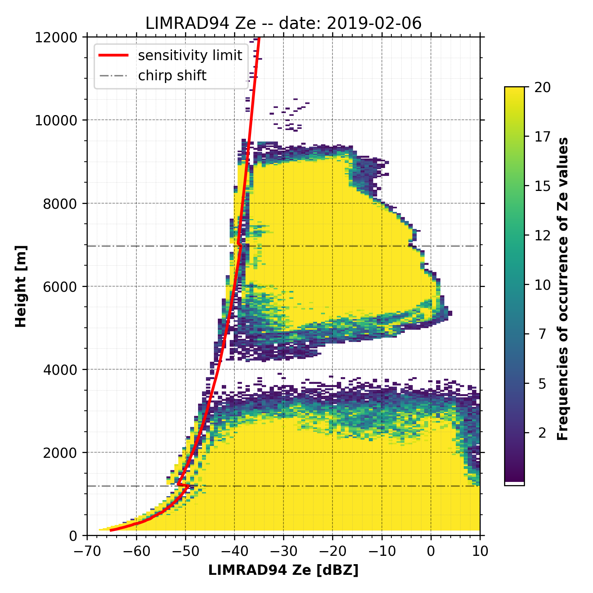

Doppler spectrum
-----------------

.. code-block:: python

    begin_dt = datetime.datetime(2019, 2, 19, 5, 16, 56)
    MIRA_Zspec = larda.read("MIRA", "Zspec", [begin_dt], [2490])
    LIMRAD94_Zspec = larda.read("LIMRAD94", "VSpec", [begin_dt], [2490])
    h.pprint(MIRA_Zspec)
    fig, ax = pyLARDA.Transformations.plot_spectra(LIMRAD94_Zspec, MIRA_Zspec, z_converter='lin2z')
    fig.savefig('single_spec.png')

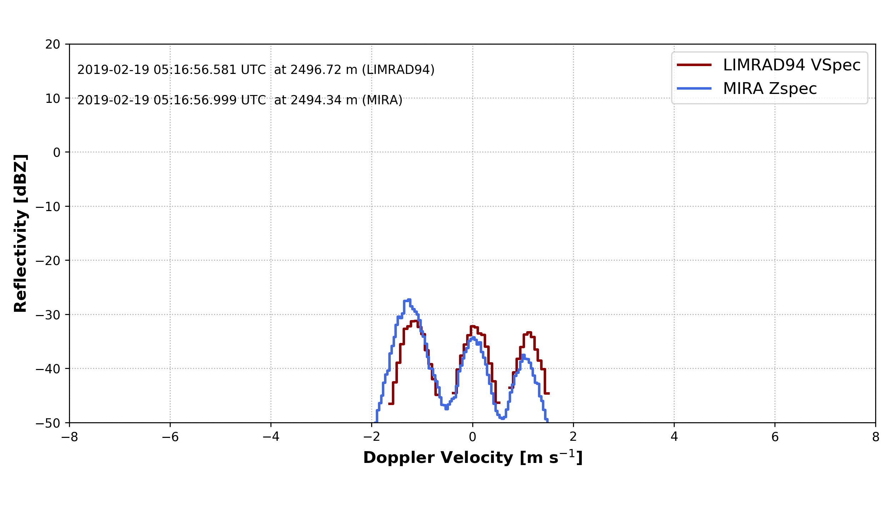

Spectrograms
------------

.. code-block:: python

    print('reading in MIRA spectra...')
    interesting_time = datetime.datetime(2019, 2, 19, 0, 45, 0)
    MIRA_Zspec_h = larda.read("MIRA", "Zspec", [interesting_time], [500, 4400])
    print('plotting MIRA spectra...')
    fig, ax = pyLARDA.Transformations.plot_spectrogram(MIRA_Zspec_h, z_converter='lin2z', v_lims=[-6, 4.5])
    fig.savefig('MIRA_range_spectrogram.png')

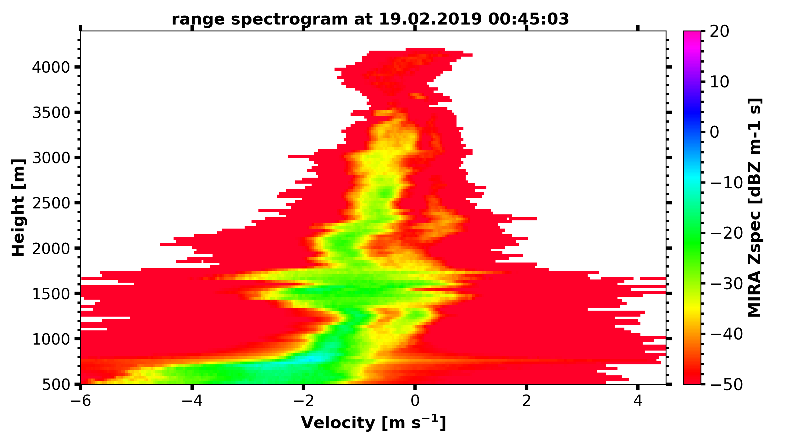

.. code-block:: python

    print('reading in LIMRAD spectra...')
    begin_dt = datetime.datetime(2019, 2, 19, 0, 30, 0)
    end_dt = datetime.datetime(2019, 2, 19, 1, 0, 0)
    LIMRAD_Zspec_t = larda.read("LIMRAD94", "VSpec", [begin_dt, end_dt], [2500])
    print('plotting LIMRAD spectra...')
    fig, ax = pyLARDA.Transformations.plot_spectrogram(LIMRAD_Zspec_t, z_converter='lin2z', v_lims=[-6, 4.5])
    fig.savefig('LIMRAD_time_spectrogram.png')

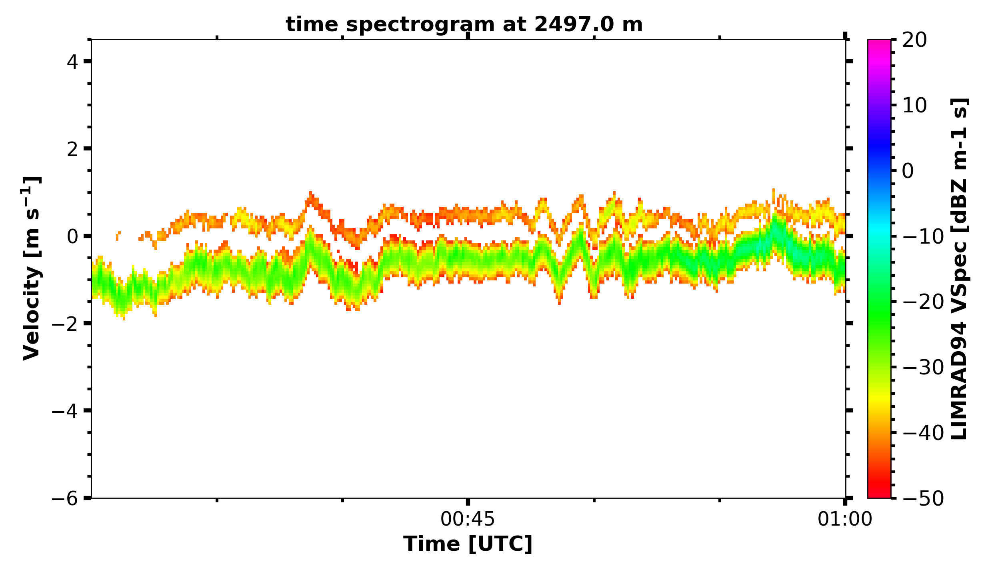

Wind barbs
----------

.. code-block:: python

    import pyLARDA.wyoming as uwyo
    begin_dt = datetime.datetime(2018, 12, 21, 11, 1, 0)
    end_dt = datetime.datetime(2018, 12, 21, 14, 59, 0)

    date_sounding = datetime.datetime(2018, 12, 21, 12)
    # download the sounding from the uwyo page
    wind_sounding = uwyo.get_sounding(date_sounding, 'SCCI')
    # load the Doppler lidar u and v components
    u_wind_shaun = larda.read( "SHAUN", "u_vel", [begin_dt, end_dt], [0, 'max'])
    v_wind_shaun = larda.read( "SHAUN", "v_vel", [begin_dt, end_dt], [0, 'max'])

    fig, ax = pyLARDA.Transformations.plot_barbs_timeheight(
        u_wind_shaun, v_wind_shaun, wind_sounding, range_interval=[0, 6000])
    fig.savefig('horizontal_wind_barbs.png')

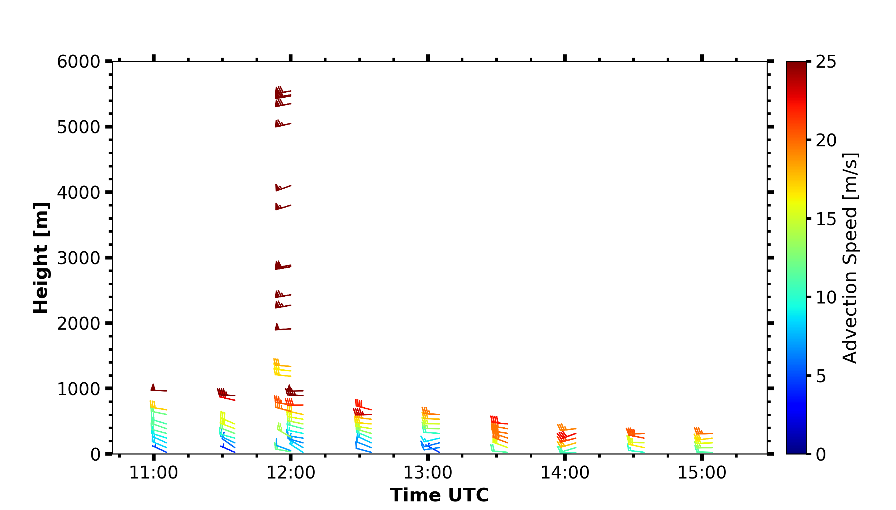

MIRA Scans
----------

.. code-block:: python

    dt = datetime.datetime(2019, 4, 18, 21, 30, 0)

    MIRA_rhi_SLDR = larda.read("MIRA", "rhi_LDRg", [dt], [0, 'max'])
    MIRA_rhi_elv = larda.read("MIRA", "rhi_elv", [dt])

    fig, ax = pyLARDA.Transformations.plot_rhi(MIRA_rhi_SLDR,
                MIRA_rhi_elv, z_converter='lin2z')
    fig.savefig('MIRA_rhi_scan_SLDR.png')

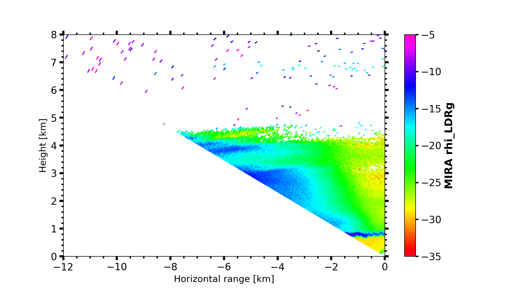

.. code-block:: python

    dt = datetime.datetime(2019, 4, 18, 23, 30, 0)

    MIRA_ppi_azi = larda.read("MIRA", "ppi_azi", [dt])
    MIRA_ppi_vel = larda.read("MIRA", "ppi_VELg", [dt], [0, 'max'])

    fig, ax = pyLARDA.Transformations.plot_ppi(MIRA_ppi_vel, MIRA_ppi_azi, cmap='seismic')
    fig.savefig('MIRA_ppi_scan_vel.png')

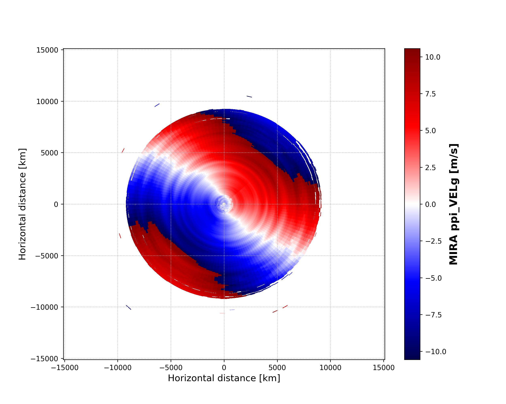

Backscatter with overlay
------------------------

.. code-block:: python

    begin_dt=datetime.datetime(2017,9,14,0,0)
    end_dt=datetime.datetime(2017,9,14,23,59)

    pollynet_qbsc1064 = larda.read("POLLYNET","qbsc1064",[begin_dt,end_dt],[0,8000])
    times = larda.read("POLLYNETprofiles","end_time",[begin_dt, end_dt])

    dt = datetime.datetime(2017, 9, 14, 20, 0)
    bsc_532 = larda.read("POLLYNETprofiles","aerBsc_raman_532",[dt],[0,8000])

    dt = datetime.datetime(2017, 9, 14, 3, 30)
    bsc_532_early = larda.read("POLLYNETprofiles","aerBsc_raman_532",[dt],[0,8000])

    def add_profile_inset(fig, ax, bsc_532, rel_xloc):
        # print(h.ts_to_dt(bsc_532['ts']))
        # print(h.ts_to_dt(pollynet_qbsc1064['ts'][-1])-h.ts_to_dt(pollynet_qbsc1064['ts'][0]))

        inset_width = 0.1
        print('calculated inset x position ', rel_xloc)

        # add an inset plot with the 'proper profile'
        # These are in unitless percentages of the figure size. (0,0 is bottom left)
        from mpl_toolkits.axes_grid1.inset_locator import inset_axes
        axins = inset_axes(ax, width="100%", height="100%",
                        bbox_to_anchor=(rel_xloc, 0.00, inset_width, 1),
                        bbox_transform=ax.transAxes, borderpad=0)
        # actually plot the profile
        axins.plot(bsc_532['var'][0,:]*1e6, bsc_532['rg'], 
                color='red', label='532')
        # make a faint background
        axins.patch.set_facecolor('white')
        axins.patch.set_alpha(0.5)
        # set the height interval of the inset similar to the colorplot
        axins.set_ylim(range_interval)
        axins.set_xlim(0,3)
        #axins.axes.get_yaxis().set_visible(False)
        #spines are the borders of the inset plot
        axins.spines['left'].set_visible(False)
        axins.spines['right'].set_visible(False)
        # disable the tick marks of the inset plot
        axins.tick_params(axis='both', left=False, top=True, right=False, bottom=False,
                        labelleft=False, labeltop=True, labelright=False, labelbottom=False)
        # label the inset axis on top
        axins.set_xlabel(bsc_532['name'], color='red', fontsize=12)
        axins.xaxis.set_label_position('top')
        axins.tick_params(axis='both', which='major', labelsize=12,
                        direction='in', color='r', labelcolor='r', width=2, length=5.5)
        
        return fig, ax, axins

    # make the colorplot with the usual Transformations.plot_timeheight(...)
    range_interval = [300, 8000]
    fig, ax = pyLARDA.Transformations.plot_timeheight(
        pollynet_qbsc1064, range_interval=range_interval, var_converter='log')

    # add first profile
    rel_xloc = (bsc_532['ts'][0]-pollynet_qbsc1064['ts'][0])/ \
                    (pollynet_qbsc1064['ts'][-1]-pollynet_qbsc1064['ts'][0])
    fig, ax, axins = add_profile_inset(fig, ax, bsc_532, rel_xloc)

    # and the second one
    rel_xloc = (bsc_532_early['ts'][0]-pollynet_qbsc1064['ts'][0])/ \
                    (pollynet_qbsc1064['ts'][-1]-pollynet_qbsc1064['ts'][0])
    fig, ax, axins = add_profile_inset(fig, ax, bsc_532_early, rel_xloc)

    fig.subplots_adjust(top=0.90)
    fig.savefig('POLLYNET_quasi_bsc_with_inset.png', dpi = 250)

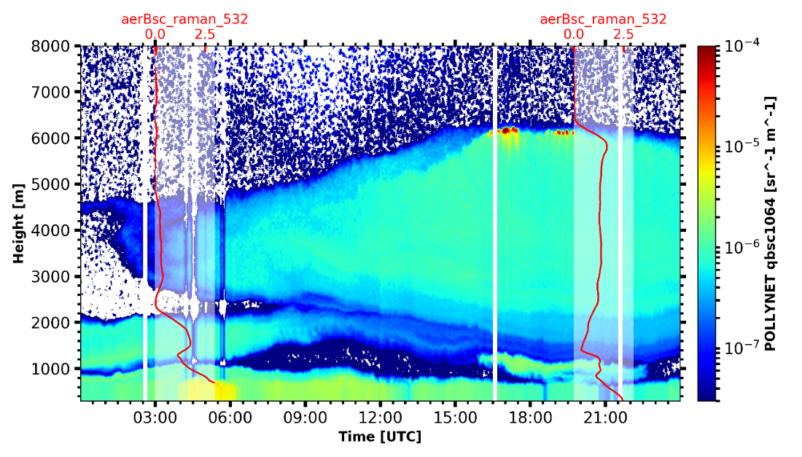